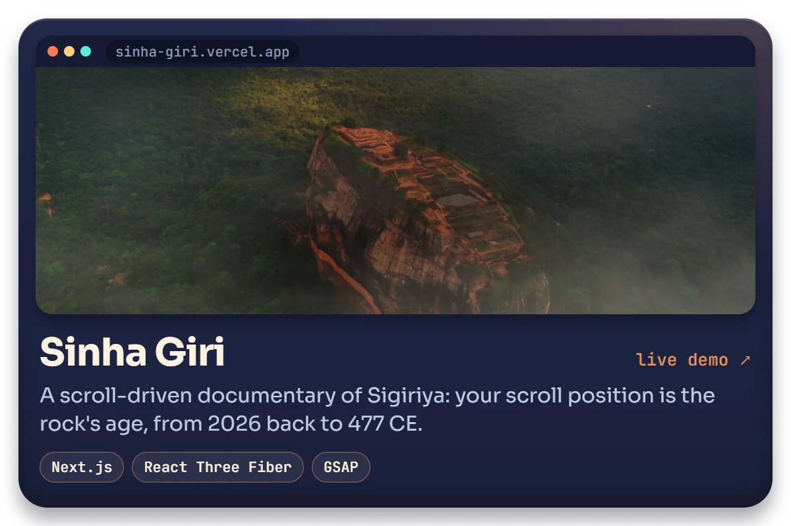
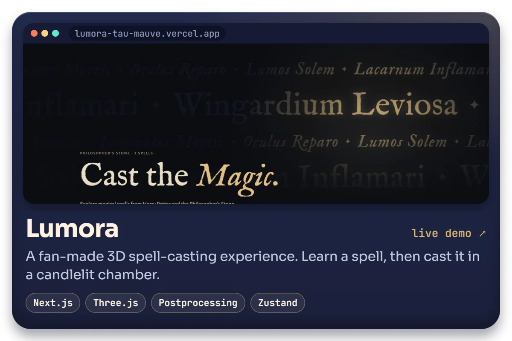
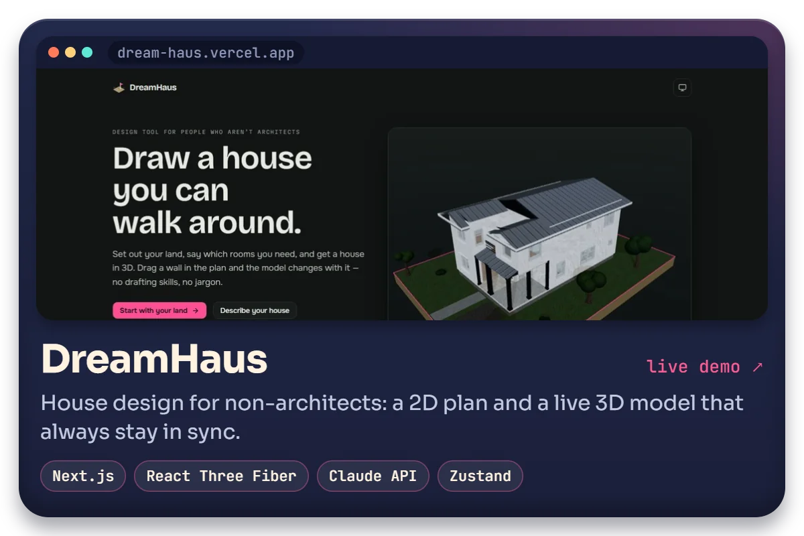
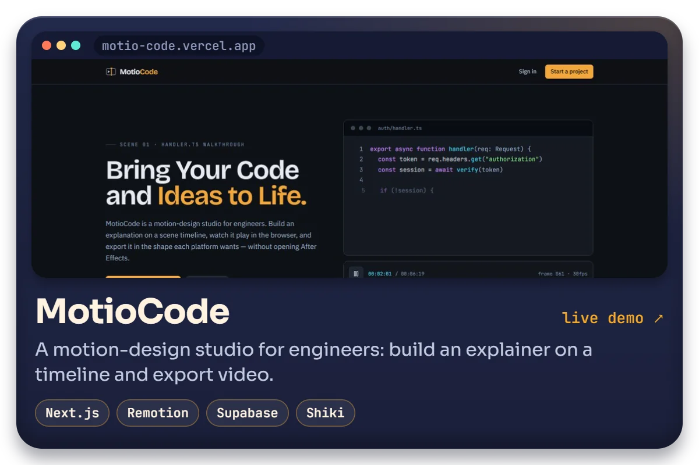
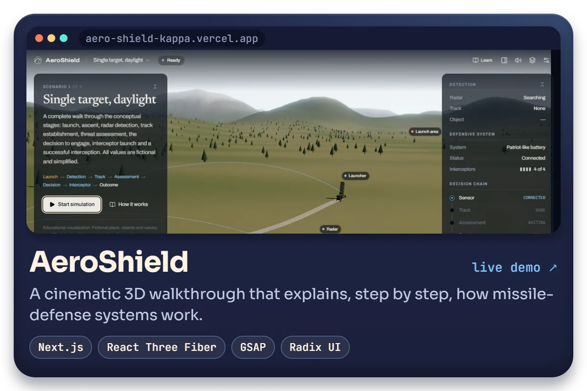
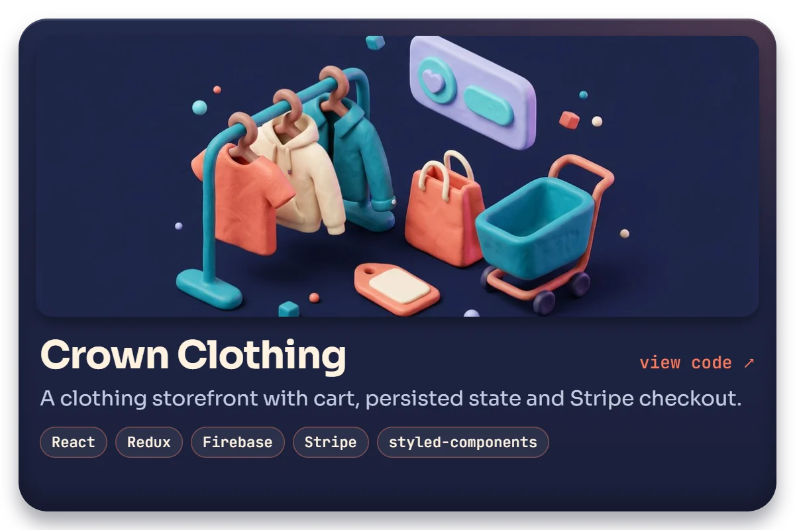

  

<picture>
  <source media="(prefers-color-scheme: dark)" srcset="assets/headers/about-dark.svg">
  
</picture>

I'm a Senior Front-End Developer with **13+ years** of turning complex products into interfaces that feel fast, clear and easy to use. I work mostly in **TypeScript, React, Next.js and Angular**, and lately I've been pushing the browser further with **Three.js, GSAP** and scroll-driven storytelling. I care about scalable, maintainable codebases and about the small details that make a UI feel right.

- 🌍 Based in **Sri Lanka**
- 🤝 Open to collaborating on **open-source front-end projects**
- ✉️ Reach me at [subash.rodrigo@gmail.com](mailto:subash.rodrigo@gmail.com)

 

<picture>
  <source media="(prefers-color-scheme: dark)" srcset="assets/headers/toolbox-dark.svg">
  
</picture>

<!-- toolbox:start -->

<picture><source media="(prefers-color-scheme: dark)" srcset="assets/toolbox/labels/languages-dark.svg"></picture>

<picture><source media="(prefers-color-scheme: dark)" srcset="assets/toolbox/labels/frontend-dark.svg"></picture>

<picture><source media="(prefers-color-scheme: dark)" srcset="assets/toolbox/labels/styling-dark.svg"></picture>

<picture><source media="(prefers-color-scheme: dark)" srcset="assets/toolbox/labels/backend-dark.svg"></picture>

<picture><source media="(prefers-color-scheme: dark)" srcset="assets/toolbox/labels/tooling-dark.svg"></picture>

<!-- toolbox:end -->

  

<picture>
  <source media="(prefers-color-scheme: dark)" srcset="assets/headers/work-dark.svg">
  
</picture>

  
  

  
  

  
  

 

<picture>
  <source media="(prefers-color-scheme: dark)" srcset="assets/headers/stats-dark.svg">
  
</picture>

  
  

  

<picture>
  <source media="(prefers-color-scheme: dark)" srcset="assets/headers/offline-dark.svg">
  
</picture>

- 🧠 Learning **German**, and going deeper on **Next.js** and **GraphQL**
- 🏏 Truly mad about **cricket**

 

<picture>
  <source media="(prefers-color-scheme: dark)" srcset="assets/headers/find-dark.svg">
  
</picture>

 <a href="https://www.linkedin.com/in/subash-rodrigo/" target="_blank" rel="noreferrer"> <picture> <source media="(prefers-color-scheme: dark)" srcset="https://raw.githubusercontent.com/danielcranney/readme-generator/main/public/icons/socials/linkedin-dark.svg" /> <source media="(prefers-color-scheme: light)" srcset="https://raw.githubusercontent.com/danielcranney/readme-generator/main/public/icons/socials/linkedin.svg" />  </picture> </a>&nbsp; <a href="https://www.github.com/SubashRandika" target="_blank" rel="noreferrer"> <picture> <source media="(prefers-color-scheme: dark)" srcset="https://raw.githubusercontent.com/danielcranney/readme-generator/main/public/icons/socials/github-dark.svg" /> <source media="(prefers-color-scheme: light)" srcset="https://raw.githubusercontent.com/danielcranney/readme-generator/main/public/icons/socials/github.svg" />  </picture> </a>&nbsp; <a href="https://www.x.com/RodrigoSubash" target="_blank" rel="noreferrer"> <picture> <source media="(prefers-color-scheme: dark)" srcset="https://raw.githubusercontent.com/danielcranney/readme-generator/main/public/icons/socials/twitter-dark.svg" /> <source media="(prefers-color-scheme: light)" srcset="https://raw.githubusercontent.com/danielcranney/readme-generator/main/public/icons/socials/twitter.svg" />  </picture> </a>&nbsp; <a href="https://www.codepen.io/subashrandika" target="_blank" rel="noreferrer"> <picture> <source media="(prefers-color-scheme: dark)" srcset="https://raw.githubusercontent.com/danielcranney/readme-generator/main/public/icons/socials/codepen-dark.svg" /> <source media="(prefers-color-scheme: light)" srcset="https://raw.githubusercontent.com/danielcranney/readme-generator/main/public/icons/socials/codepen.svg" />  </picture> </a>&nbsp; <a href="https://www.dev.to/subashrandika" target="_blank" rel="noreferrer"> <picture> <source media="(prefers-color-scheme: dark)" srcset="https://raw.githubusercontent.com/danielcranney/readme-generator/main/public/icons/socials/devdotto-dark.svg" /> <source media="(prefers-color-scheme: light)" srcset="https://raw.githubusercontent.com/danielcranney/readme-generator/main/public/icons/socials/devdotto.svg" />  </picture> </a>&nbsp; <a href="https://frontloop.hashnode.dev" target="_blank" rel="noreferrer"> <picture> <source media="(prefers-color-scheme: dark)" srcset="https://raw.githubusercontent.com/danielcranney/readme-generator/main/public/icons/socials/hashnode-dark.svg" /> <source media="(prefers-color-scheme: light)" srcset="https://raw.githubusercontent.com/danielcranney/readme-generator/main/public/icons/socials/hashnode.svg" />  </picture> </a>&nbsp; <a href="http://www.medium.com/@subash.rodrigo" target="_blank" rel="noreferrer"> <picture> <source media="(prefers-color-scheme: dark)" srcset="https://raw.githubusercontent.com/danielcranney/readme-generator/main/public/icons/socials/medium-dark.svg" /> <source media="(prefers-color-scheme: light)" srcset="https://raw.githubusercontent.com/danielcranney/readme-generator/main/public/icons/socials/medium.svg" />  </picture> </a>&nbsp; <a href="https://www.stackoverflow.com/users/subashrodrigo" target="_blank" rel="noreferrer"> <picture> <source media="(prefers-color-scheme: dark)" srcset="https://raw.githubusercontent.com/danielcranney/readme-generator/main/public/icons/socials/stackoverflow-dark.svg" /> <source media="(prefers-color-scheme: light)" srcset="https://raw.githubusercontent.com/danielcranney/readme-generator/main/public/icons/socials/stackoverflow.svg" />  </picture> </a>&nbsp; <a href="https://www.facebook.com/subash.rodrigo" target="_blank" rel="noreferrer"> <picture> <source media="(prefers-color-scheme: dark)" srcset="https://raw.githubusercontent.com/danielcranney/readme-generator/main/public/icons/socials/facebook-dark.svg" /> <source media="(prefers-color-scheme: light)" srcset="https://raw.githubusercontent.com/danielcranney/readme-generator/main/public/icons/socials/facebook.svg" />  </picture> </a>

